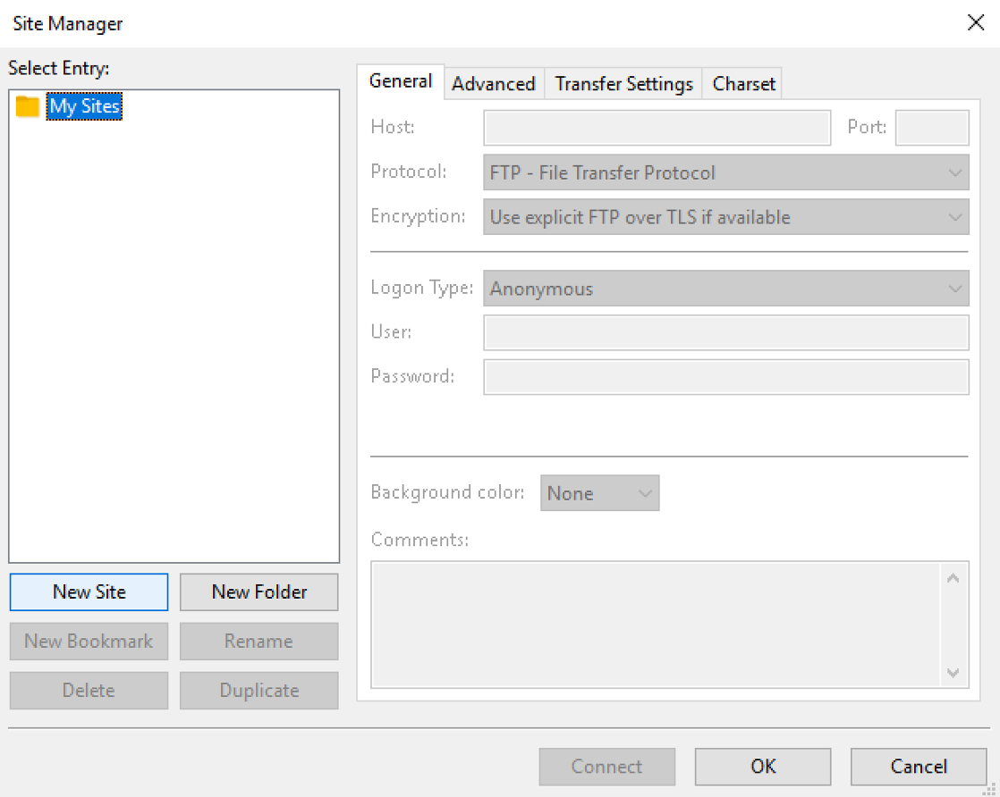
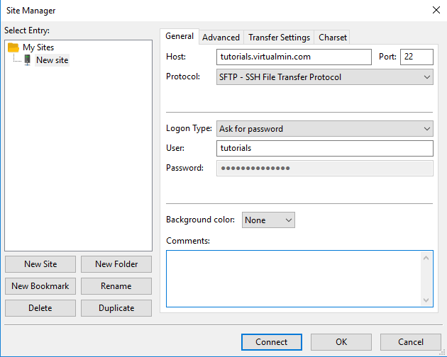
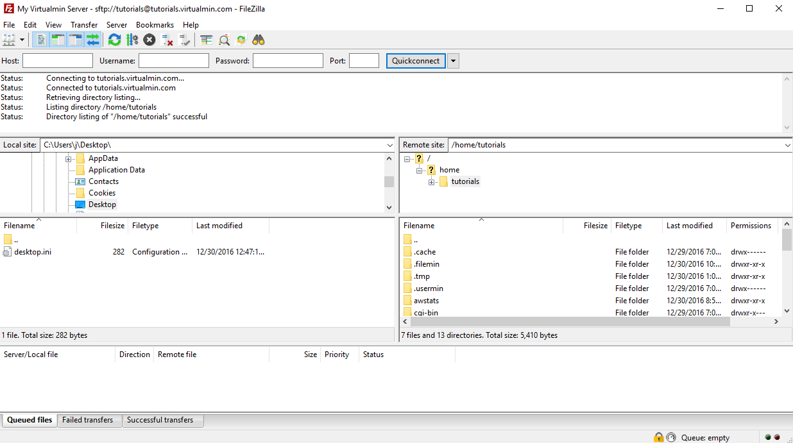
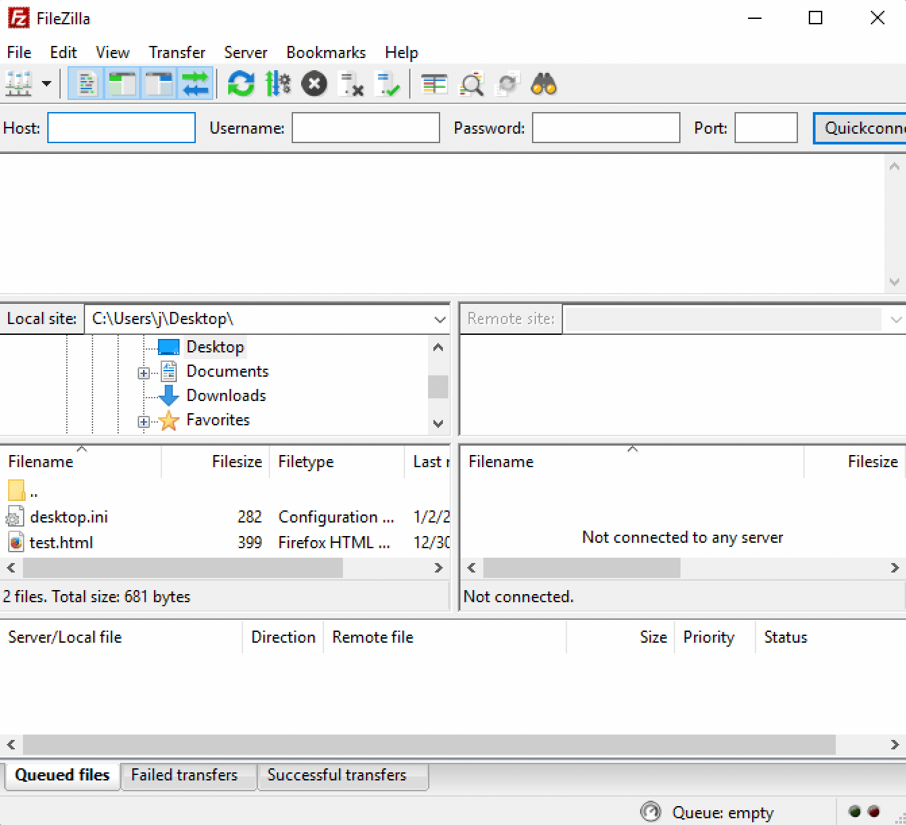

# How to upload web content to your Virtualmin website
There are multiple ways to upload web content to your Virtualmin website. Below we cover how to do it from the web interface, an SFTP client, and from the command line via the _scp_ command. All of these methods are secure options to upload files to your Virtualmin website.

## Web interface
A quick and secure way to upload files to your website is to use the Webmin File Manager from your web browser.

1. Log into your Virtualmin account via your web browser.

1. Click the *Webmin* tab and then *Others > File Manager* in the left side menu


1. You will see the _public_html_ directory by default. If you want to upload a file to a different directory, click on the folder icon to navigate to the directory you want to upload a file to.

1. Click *File > Upload to current directory*


1. Click the _Paperclip_ icon to select a file from your computer to upload


1. Find the file on your computer you want to upload and double-click on it.

1. Your filename will show up in the _Upload to current directory_ popup. Click the _Upload Files_ button.


1. Depending on how large your file is, it may take a while to upload. Once the upload is completed, you will see it listed in the File Manager and be able to access it via your web browser.


## SFTP
SFTP is a secure and robust way to upload files to your website. In addition to uploading files, SFTP can be used for nearly all your file management needs for your website.

Before you follow the steps below, you'll need to have an SFTP client installed. [Filezilla](tutorials/upload_file/https://filezilla-project.org/ "Filezilla project and download site") is a popular Open Source client that works on Windows, Mac and Linux.

The following steps cover configuring a site in Filezilla and uploading a file through the app via SFTP.

1. Open Filezilla on your computer

1. Click *File > Site Manager*


1. Click the _New Site_ button


1. Select _SFTP - SSH File Transfer Protocol_ from the _Protocol_ drop down listed

1. Populate the following fields:

   _Host:_ Enter your site's host name or IP address

   _Port:_ Enter _22_ unless you know the port is different than the default SSH port for your server

   _Logon Type:_ Select _Ask for password_ (so your password is not stored in clear text on the computer)

   _User:_ Enter the username for the Virtualmin user of the site you want to upload files for


1. Click the _Connect_ button

(If you're prompted to accept the SSH key from the host, click the _OK_ button)

1. Enter the password for the user you entered previously


1. You are connected to your server. The server files are displayed on the right and your local computer files are displayed on the left.


1. Double-click on the _public_html_ folder on the right to navigate to your site's web directory

1. Find the file you want to upload by navigating through the folders on the left

1. Drag the file you want to upload from your computer (on the left) to your website on the right


1. If your file takes a while to upload, you will see its progress in the bottom Filezilla panel



## SSH/SCP
Sometimes you want to upload files via a command line interface. You can do this using SCP, which is the secure way to copy files over SSH.

### Windows
A popular SSH and SCP client on Windows is [Putty](tutorials/upload_file/http://www.putty.org/ "Putty Windows SSH and SCP client"). Download the _pscp.exe_ utility in order to transfer files securely via a Windows command.

Once you've downloaded _pscp.exe_, open a Windows command prompt and run the following from the same folder where the _pscp.exe_ file is to copy a test.html file from your Desktop folder to your host's _public_html_ directory:

```pscp -scp C:\Users\username\Desktop\test.html username@hostname:public_html/```

You may be prompted to accept an SSH key from the host. Enter _yes_ and then proceed to enter the password for the username you provided. The file progress will display and show 100% when completed.

```test.html                 | 0 kB |   0.4 kB/s | ETA: 00:00:00 | 100%```

### Mac and Linux
The _scp_ command is already available on Mac and Linux. Open a terminal window on run the following command to upload a _test.html_ file in your home directory to the host's _public_html_ directory:

```scp ~/test.html username@hostname:public_html/```

You may be prompted to accept an SSH key from the host. Enter _yes_ and then proceed to enter the password for the username you provided. The file progress will display and show 100% when completed.

```test.html                                     100%  399     8.8KB/s   00:00```Â
